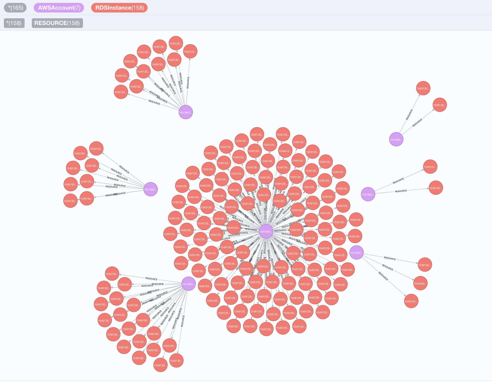

Cartography is a Python tool that consolidates infrastructure assets and the relationships between them in an intuitive graph view powered by a [Neo4j](https://www.neo4j.com) database.

<!-- START doctoc generated TOC please keep comment here to allow auto update -->
<!-- DON'T EDIT THIS SECTION, INSTEAD RE-RUN doctoc TO UPDATE -->
**Table of Contents**  *generated with [DocToc](https://github.com/thlorenz/doctoc)*

- [Why Cartography?](#why-cartography)
- [Install and configure](#install-and-configure)
- [Supported platforms](#supported-platforms)
- [Usage](#usage)
- [Contact](#contact)
- [Community Meeting](#community-meeting)
- [Contributing](#contributing)
  - [Code of conduct](#code-of-conduct)
  - [Developing Cartography](#developing-cartography)
    - [Sign the Contributor License Agreement (CLA)](#sign-the-contributor-license-agreement-cla)
- [Who uses Cartography?](#who-uses-cartography)

<!-- END doctoc generated TOC please keep comment here to allow auto update -->

## Why Cartography?
Cartography aims to enable a broad set of exploration and automation scenarios.  It is particularly good at exposing otherwise hidden dependency relationships between your service's assets so that you may validate assumptions about security risks.

Service owners can generate asset reports, Red Teamers can discover attack paths, and Blue Teamers can identify areas for security improvement.   All can benefit from using the graph for manual exploration through a web frontend interface, or in an automated fashion by calling the APIs.

Cartography is not the only [security](https://github.com/dowjones/hammer) [graph](https://github.com/BloodHoundAD/BloodHound) [tool](https://github.com/Netflix/security_monkey) [out](https://github.com/vysecurity/ANGRYPUPPY) [there](https://github.com/duo-labs/cloudmapper), but it differentiates itself by being fully-featured yet generic and [extensible](docs/dev/writing-analysis-jobs.md) enough to help make anyone better understand their risk exposure, regardless of what platforms they use.  Rather than being focused on one core scenario or attack vector like the other linked tools, Cartography focuses on flexibility and exploration.

You can learn more about the story behind Cartography in our [presentation at BSidesSF 2019](https://www.youtube.com/watch?v=ZukUmZSKSek).

## Install and configure
Start [here](docs/setup/install.md).

## Supported platforms
- [Amazon Web Services](docs/setup/config/aws.md) -  EC2, Elasticsearch, Elastic Kubernetes Service, DynamoDB, IAM, Lambda, RDS, Redshift, Route53, S3, STS, Tags
- [Google Cloud Platform](docs/setup/config/gcp.md) - Cloud Resource Manager, Compute, DNS, Storage, Google Kubernetes Engine
- [Google GSuite](docs/setup/config/gsuite.md) - users, groups
- [Duo CRXcavator](docs/setup/config/crxcavator.md) - Chrome extensions, GSuite users
- [Okta](docs/setup/config/okta.md) - users, groups, organizations, roles, applications, factors, trusted origins, reply URIs
- [Github](docs/setup/config/github.md) - repos, branches, users

## Usage
Start with our [tutorial](docs/usage/tutorial.md). Our [data schema](docs/schema) is a helpful reference when you get stuck.

## Contact

- Join us on `#cartography` on the [Lyft OSS Slack](https://join.slack.com/t/lyftoss/shared_invite/enQtOTYzODg5OTQwNDE2LTFiYjgwZWM3NTNhMTFkZjc4Y2IxOTI4NTdiNTdhNjQ4M2Q5NTIzMjVjOWI4NmVlNjRiZmU2YzA5NTc3MmFjYTQ).

## Community Meeting

Talk to us and see what we're working on at our [monthly community meeting](https://calendar.google.com/calendar/embed?src=lyft.com_p10o6ceuiieq9sqcn1ef61v1io%40group.calendar.google.com&ctz=America%2FLos_Angeles).
- Meeting minutes are [here](https://docs.google.com/document/d/1VyRKmB0dpX185I15BmNJZpfAJ_Ooobwz0U1WIhjDxvw).
- Recorded videos are posted [here](https://www.youtube.com/playlist?list=PLMga2YJvAGzidUWJB_fnG7EHI4wsDDsE1).
- Our current project road map is [here](https://docs.google.com/document/d/18MOsGI-isFvag1fGk718Aht7wQPueWd4SqOI9KapBa8/edit#heading=h.15nsmgmjaaml).

## Contributing
Thank you for considering contributing to Cartography!

### Code of conduct
Legal stuff: This project is governed by [Lyft's code of conduct](https://github.com/lyft/code-of-conduct).
All contributors and participants agree to abide by its terms.

### Developing Cartography

Get started with our [developer documentation](docs/dev/developer-guide.md).

#### Sign the Contributor License Agreement (CLA)

We require a CLA for code contributions, so before we can accept a pull request
we need to have a signed CLA. Please [visit our CLA service](https://oss.lyft.com/cla)
and follow the instructions to sign the CLA.

## Who uses Cartography?

1. [Lyft](https://www.lyft.com)
1. [Thought Machine](https://thoughtmachine.net/)
1. [MessageBird](https://messagebird.com)
1. [Cloudanix](https://www.cloudanix.com/)
1. {Your company here} :-)

If your organization uses Cartography, please file a PR and update this list. Say hi on Slack too!
