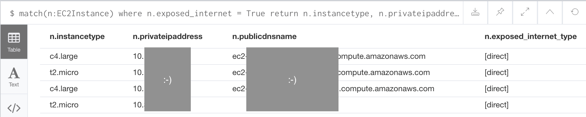

# How to extend Cartography with Analysis Jobs

## Overview
In a nutshell, Analysis Jobs let you add your own customizations to Cartography by writing Neo4j queries. This helps you add powerful enhancements to your data without the need to write Python code.

### The stages
There are 3 stages to a cartography sync. First we create database indexes, next we ingest assets via intel modules, and finally we can run Analysis Jobs on the database (see [cartography.sync.build\_default\_sync()](https://github.com/lyft/cartography/blob/master/cartography/sync.py)). This tutorial focuses on Analysis Jobs.

### How to run
Each Analysis Job is a JSON file with a list of Neo4j statements which get run in order. To run Analysis Jobs, in your call to `cartography`, set the `--analysis-job-directory` parameter to the folder path of your jobs. Although the order of statements within a single job is preserved, we don't guarantee the order in which jobs are executed.

## Example job: which of my EC2 instances is accessible to any host on the internet?
The easiest way to learn how to write an Analysis Job is through an example. One of the Analysis Jobs that we've included by default in Cartography's source tree is [cartography/data/jobs/analysis/aws_ec2_asset_exposure.json](https://github.com/lyft/cartography/blob/master/cartography/data/jobs/analysis/aws_ec2_asset_exposure.json). This tutorial covers only the EC2 instance part of that job, but after reading this you should be able to understand the other steps in that file.

### Our goal
After ingesting all our AWS data, we want to explicitly mark EC2 instances that are accessible to the public internet - a useful thing to know for anyone running an internet service. If any internet-open nodes are found, the job will add an attribute `exposed_internet = True` to the node. This way we can easily query to find the assets later on and take remediation action if needed.

But how do we make this determination, and how should we structure the job?

### The logic in plain English
We can use the following facts to tell if an EC2 instance is open to the internet:

1. The EC2 instance is a member of a Security Group that has an IP Rule applied to it that allows inbound traffic from the 0.0.0.0/0 subnet.
2. The EC2 instance has a network interface that is connected to a Security Group that has an IP Rule applied to it that allows inbound traffic from the 0.0.0.0/0 subnet.

The graph created by Cartography's sync process already has this information for us; we just need to run a few queries to properly to mark it with `exposed_internet = True`. This example is complex but we hope that this exposes enough Neo4j concepts to help you write your own queries.

### Translating the plain-English logic into Neo4j's Cypher syntax
We can take the ideas above and use Cypher's declarative syntax to "sketch" out this graph path.

1. _The EC2 instance is a member of a Security Group that has an IP Rule applied to it that allows inbound traffic from the 0.0.0.0/0 subnet._

    In Cypher, this is

    ```
    MATCH
    (:IpRange{id: '0.0.0.0/0'})-[:MEMBER_OF_IP_RULE]->(:IpPermissionInbound)
    -[:MEMBER_OF_EC2_SECURITY_GROUP]->(group:EC2SecurityGroup)
    <-[:MEMBER_OF_EC2_SECURITY_GROUP]-(instance:EC2Instance)

    SET instance.exposed_internet = true,
        instance.exposed_internet_type = coalesce(instance.exposed_internet_type , []) + 'direct';
    ```

    In the `SET` clause we add `exposed_internet = True` to the instance. We also add a field for `exposed_internet_type` to denote what type of internet exposure has occurred here. You can read the [documentation for `coalesce`](https://neo4j.com/docs/cypher-manual/current/functions/scalar/#functions-coalesce), but in English this last part says "add `direct` to the list of ways this instance is exposed to the internet".

2. _The EC2 instance has a network interface that is connected to a Security Group that has an IP Rule applied to it that allows inbound traffic from the 0.0.0.0/0 subnet._

    This is the same as the previous query except for the final line:

    ```
    MATCH
    (:IpRange{id: '0.0.0.0/0'})-[:MEMBER_OF_IP_RULE]->(:IpPermissionInbound)
    -[:MEMBER_OF_EC2_SECURITY_GROUP]->(group:EC2SecurityGroup)
    <-[:NETWORK_INTERFACE*..2]-(instance:EC2Instance)

    SET instance.exposed_internet = true,
        instance.exposed_internet_type = coalesce(instance.exposed_internet_type , []) + 'direct';
    ```

    The `*..2` operator means "within 2 hops". We use this here as a shortcut because there are a few more relationships between NetworkInterfaces and EC2SecurityGroups that we can skip over.

Finally, notice that (1) and (2) are similar enough that we can actually merge them like this:

```
MATCH
(:IpRange{id: '0.0.0.0/0'})-[:MEMBER_OF_IP_RULE]->(:IpPermissionInbound)
-[:MEMBER_OF_EC2_SECURITY_GROUP]->(group:EC2SecurityGroup)
<-[:MEMBER_OF_EC2_SECURITY_GROUP|NETWORK_INTERFACE*..2]-(instance:EC2Instance)

SET instance.exposed_internet = true,
    instance.exposed_internet_type = coalesce(instance.exposed_internet_type , []) + 'direct';
```

Kinda neat, right?

### The skeleton of an Analysis Job
Now that we know what we want to do on a sync, how should we structure the Analysis Job?  Here is the basic skeleton that we recommend.

#### Clean up first, then update
In general, the first statement(s) should be a "clean-up phase" that removes custom attributes or relationships that you may have added in a previous run. This ensures that whatever labels you add on this current run will be up to date and not stale. Next, the statements after the clean-up phase will perform the matching and attribute updates as described in the previous section.

**Here's our final result:**

```
{
  "name": "AWS asset internet exposure",
  "statements": [
      {
        "__comment": "This is a clean-up statement to remove custom attributes",
        "query": "MATCH (n)
                  WHERE n.exposed_internet IS NOT NULL
                        AND labels(n) IN ['AutoScalingGroup', 'EC2Instance', 'LoadBalancer']
                  WITH n LIMIT $LIMIT_SIZE
                  REMOVE n.exposed_internet, n.exposed_internet_type
                  RETURN COUNT(*) as TotalCompleted",
        "iterative": true,
        "iterationsize": 1000
      },
      {
        "__comment__": "This is our analysis logic as described in the section above",
        "query": MATCH (:IpRange{id: '0.0.0.0/0'})-[:MEMBER_OF_IP_RULE]->(:IpPermissionInbound)
                 -[:MEMBER_OF_EC2_SECURITY_GROUP]->(group:EC2SecurityGroup)
                 <-[:MEMBER_OF_EC2_SECURITY_GROUP|NETWORK_INTERFACE*..2]-(instance:EC2Instance)

                 SET instance.exposed_internet = true,
                     instance.exposed_internet_type = coalesce(instance.exposed_internet_type , []) + 'direct';,
        "iterative": true,
        "iterationsize": 100
      }
  ]
}
```

Setting a statement as `iterative: true` means that we will run this query on `#{iterationsize}` entries at a time. This can be helpful for queries that return large numbers of records so that Neo4j doesn't get too angry.

Now we can enjoy the fruits of our labor and query for internet exposure:



## Recap
As shown, you create an Analysis Job by putting together a bunch of `statements` together (which are essentially Neo4j queries). In general, each job should first clean up the custom attributes added by a previous run, and then it can perform the match and update steps to add the custom attributes back again. This ensures that your data is up to date.
