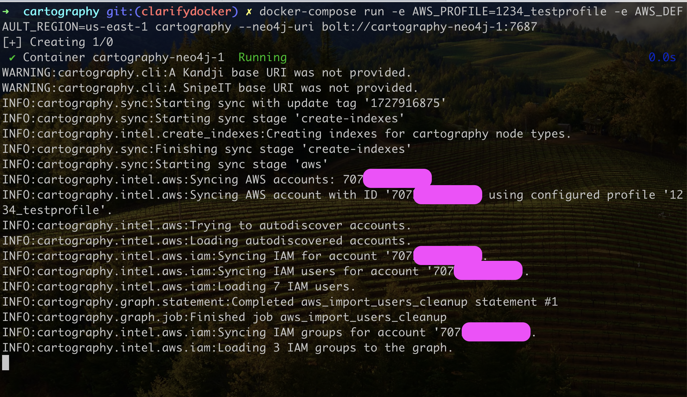
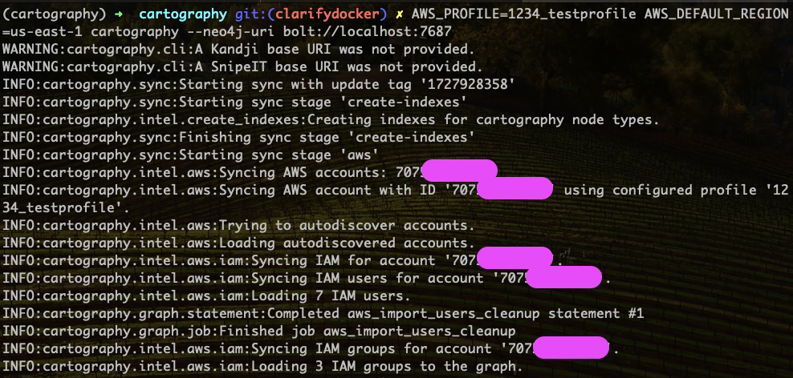

# Install and Run Cartography On Test Machine

.. _cartography-installation:

Time to set up a test machine to run Cartography.

## Option 1: Run docker-compose (preferred)

This is the quickest way to get started (assuming docker does what it's supposed to do).


1. **Start up the Neo4j graph database.**

    ```bash
    docker-compose up -d
    ```

    If this command errors out with permission problems, you may need to configure your Docker Desktop/Rancher Desktop/etc to use a different virtual machine volume setting: try virtiofs on Mac.

    It may take a minute for the Neo4j container to spin up.

1. **Configure and run Cartography.**

    In this example we will run Cartography on [AWS](https://lyft.github.io/cartography/modules/aws/config.html) with a profile called "1234_testprofile" and default region set to "us-east-1".

    ```bash
    docker-compose run \
        -e AWS_PROFILE=1234_testprofile \
        -e AWS_DEFAULT_REGION=us-east-1 \
        cartography --neo4j-uri bolt://cartography-neo4j-1:7687
    ```

    If you get a connection error like `ValueError: Cannot resolve address cartography-neo4j-1:7687`, you may need to wait a bit for the Neo4j container to be ready. Run `docker ps` periodically to check on it and then retry the `docker-compose run ..` command.

    You will know it works when your terminal shows log messages displaying how many assets are being loaded to the graph:

    

    **Notes:**
    - You can view a full list of Cartography's CLI arguments by running `docker-compose run cartography --help`.

    - Also see the configuration section of [each relevant intel module](https://lyft.github.io/cartography/modules) to set up each data source. This generally involves specifying environment variables to cartography, or making a config/credential file on the host available to the container.

        - You can pass in environment variables to the cartography container using the docker-compose format like this: `-e VARIABLE1 -e VARIABLE2=value2`.
        - You can make files available to the cartography container by editing the volumes in the docker-compose.yml file. See docker-compose documentation on how to do that.

    - `cartography-neo4j-1` is how the Cartography docker container knows how to reach the Neo4j container in docker-compose.

    - AWS things

        - `AWS_DEFAULT_REGION` must be specified.
        - The docker-compose.yml maps in `~/.aws/` on your host machine to `/var/cartography/.aws` in the cartography container so that the container has access to AWS profile and credential files.

1. **View the graph.**

   You can view the graph while it is still syncing by visiting http://localhost:7474. Try a query like

    ```cypher
    match (i:AWSRole)--(c:AWSAccount) return *
   ```

    It should look like this:

    

1. **Optional**: If you want to configure the Neo4j container itself, you can do this via the `.compose` directory, which is
git ignored. neo4j config, logs, etc are all located at `.compose/neo4j/...`

1. **Optional**: You can supply additional environment variables via `docker-compose` like this:
    ```bash
    # Temporarily disable bash command history
    set +o history
    # See the cartography github configuration intel module docs
    export GITHUB_KEY=BASE64ENCODEDKEY
    # You need to set this after starting neo4j once, and resetting
    # the default neo4j password, which is neo4j
    export NEO4j_PASSWORD=...
    # Reenable bash command history
    set -o history
    # Start cartography dependencies
    docker-compose up -d
    # Run cartography
    docker-compose run -e GITHUB_KEY -e NEO4j_PASSWORD cartography cartography --github-config-env-var GITHUB_KEY --neo4j-uri bolt://neo4j:7687 --neo4j-password-env-var NEO4j_PASSWORD --neo4j-user neo4j
    ```


Read on to see [other things you can do with Cartography](#things-to-do-next).

## Option 2: manually run 2 containers

1. **Run the Neo4j graph database container.**

    ```bash
    # Create a docker network so that cartography can talk to neo4j
    docker network create cartography-network

    # run the Neo4j graph database
    docker run \
        --publish=7474:7474 \
        --publish=7687:7687 \
        --network cartography-network \
        -v data:/data \
        --name cartography-neo4j \
        --env=NEO4J_AUTH=none \
        neo4j:4.4-community
    ```

    - Refer to the Neo4j Docker [official docs](https://github.com/neo4j/docker-neo4j) for more information.

    - Note that we are just playing around here on a test instance and have specified `--env=NEO4J_AUTH=none` to turn off authentication.

    - If you experience very slow write performance using an ARM-based machine like an M1 Mac, see if using an ARM image helps. Neo4j keeps ARM builds [here](https://hub.docker.com/r/arm64v8/neo4j/).

1. **Configure and run Cartography.**

    See the configuration section of [each relevant intel module](https://lyft.github.io/cartography/modules) to set up each data source. In this example we will use [AWS](https://lyft.github.io/cartography/modules/aws/config.html).

    This command runs cartography on an AWS profile called "1234_testprofile" on region us-east-1. We also expose the host machine's ~/.aws directory to ~/var/cartography/.aws in the container so that AWS configs work.

     ```bash
    docker run --rm \
        --network cartography-network \
        -v ~/.aws:/var/cartography/.aws/ \
        -e AWS_PROFILE=1234_testprofile \
        -e AWS_DEFAULT_REGION=us-east-1 \
        lyft/cartography --neo4j-uri bolt://cartography-neo4j:7687
     ```

   If things work, your terminal will look like this where you see log messages displaying how many assets are being loaded to the graph:

    

    ### Notes:

    - You pass in environment variables to the cartography container using the docker format like this: `-e VARIABLE1 -e VARIABLE2=value2`.

    - AWS things

      - `AWS_DEFAULT_REGION` must be specified.
      - Our docker-compose.yml maps in `~/.aws/` on your host machine to `/var/cartography/.aws` in the cartography container, so the container has access to AWS profile and credential files.
    - You can view a full list of Cartography's CLI arguments by running `docker run lyft/cartography --help`.

1. **View the graph.**

   You can view the graph while it is still syncing by visiting http://localhost:7474. Try a query like

    ```cypher
    match (i:AWSRole)--(c:AWSAccount) return *
   ```

    It should look like this:

    

Read on to see [other things you can do with Cartography](#things-to-do-next).

## Option 3: Native install

Do this if you prefer to install and manage all the dependencies yourself. Cartography _should_ work on Linux, Mac, and Windows, but bear in mind we haven't tested much on Windows so far.


1. **Ensure that you have Python 3.10 set up on your machine.**

    Older or newer versions of Python may work but are not explicitly supported. You will probably have more luck with newer versions.

1. **Run Neo4j graph database version 4.4 or higher. 4.3 and lower will _not_ work.**

        ⚠️ Neo4j 5.x will probably work since it's included in our test suite, but we do not explicitly support it yet.

    1. We recommend running Neo4j as a Docker container so that you save time and don't need to install Java. Run `docker run --publish=7474:7474 --publish=7687:7687 -v data:/data --env=NEO4J_AUTH=none neo4j:4.4-community`.

    1. Otherwise, if you prefer to **install Neo4j from scratch**,

        1. Neo4j requires a JVM (JDK/JRE 11 or higher). One option is [Amazon Coretto 11](https://docs.aws.amazon.com/corretto/latest/corretto-11-ug/what-is-corretto-11.html).

            ⚠️ Make sure you have the `JAVA_HOME` environment variable set. The following works for Mac OS: `export JAVA_HOME=$(/usr/libexec/java_home)`

        1. Go to the [Neo4j download page](https://neo4j.com/download-center/#community), and download Neo4j Community Edition 4.4.\*.

        1. [Install](https://neo4j.com/docs/operations-manual/current/installation/) Neo4j.

            ⚠️ For local testing, you might want to turn off authentication via property `dbms.security.auth_enabled` in file NEO4J_PATH/conf/neo4j.conf

1. **Install cartography to the current Python virtual environment with `pip install cartography`.**

    We recommend creating a separate venv for just Cartography and its dependencies. You can read about venvs [here](https://packaging.python.org/en/latest/guides/installing-using-pip-and-virtual-environments/#create-and-use-virtual-environments), and searching on how to use tools like pyenv and pyenv-virtualenv.

1. **Configure your data sources.**

    See the configuration section of [each relevant intel module](https://lyft.github.io/cartography/modules) for more details. In this example we will use [AWS](https://lyft.github.io/cartography/modules/aws/config.html).

1. **Run cartography.**

    - For a specific AWS account defined as a separate profile in your AWS config file, set the `AWS_PROFILE` environment variable, for example this command runs cartography on an AWS profile called "1234_testprofile" on region us-east-1.

        ```bash
        AWS_PROFILE=1234_testprofile AWS_DEFAULT_REGION=us-east-1 cartography --neo4j-uri bolt://localhost:7687
        ```

    - For one account using the `default` profile defined in your AWS config file, run

        ```bash
        cartography --neo4j-uri bolt://localhost:7687
        ```

    - For more than one AWS account, run

        ```bash
        AWS_CONFIG_FILE=/path/to/your/aws/config cartography --neo4j-uri bolt://localhost:7687 --aws-sync-all-profiles
        ```

    You can view a full list of Cartography's CLI arguments by running `cartography --help`.

    If everything worked, the sync will pull data from your configured accounts and ingest data to Neo4j! This process might take a long time if your account has a lot of assets.
    

1. **View the graph.**
    You can view the graph while it is still syncing by visiting http://localhost:7474. Try a query like

    ```cypher
    match (i:AWSRole)--(c:AWSAccount) return *
   ```

    It should look like this:

    

## Things to do next
Here's some ideas to get the most out of Cartography:
- [Set up other data providers](https://lyft.github.io/cartography/modules)
- View our [Operations Guide](ops.html) for tips on running Cartography in production
- Read our [usage instructions](https://lyft.github.io/cartography/usage/tutorial.html) and [schema](https://lyft.github.io/cartography/usage/schema.html) to learn how to query the graph
- Think of [applications](https://lyft.github.io/cartography/usage/applications.html) to build around it
- Consider [writing your own Cartography custom modules](dev/writing-intel-modules.md)
